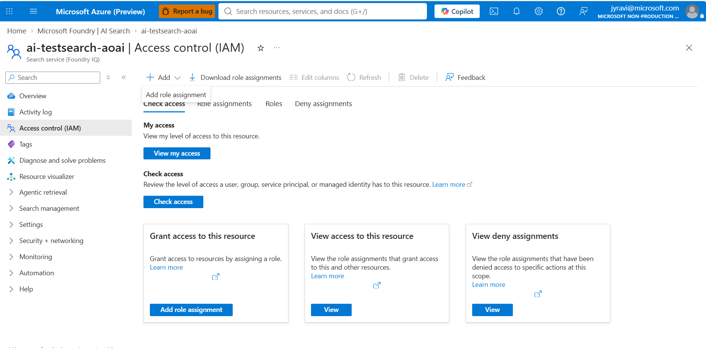
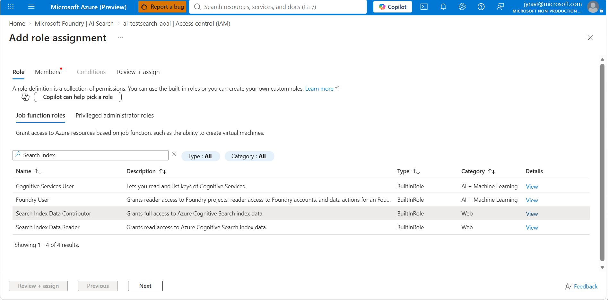
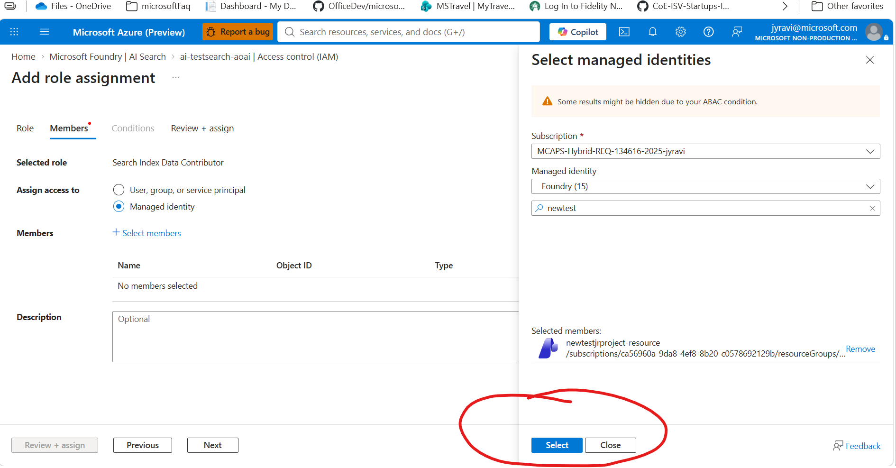
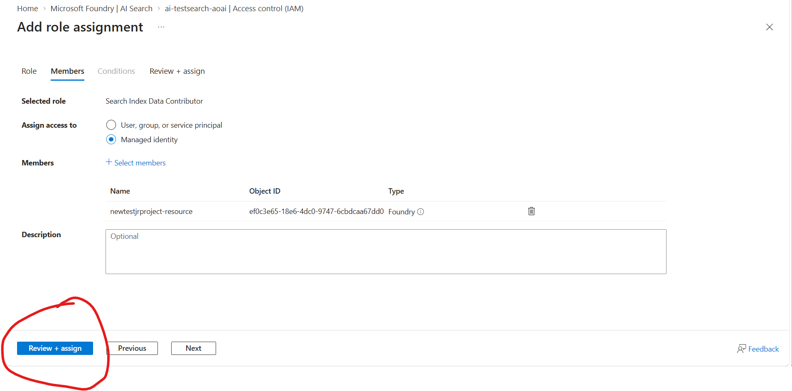

# Environment Setup

This is the first step for all workshop attendees. Complete the prerequisites and create your Microsoft Foundry project before the workshop begins.

---

## Prerequisites

- Azure subscription

---

## Create Foundry Project

### Method 1

1. Sign in to [Microsoft Foundry](https://ai.azure.com) "https://ai.azure.com". Make sure the **New Foundry** toggle is on.
2. Create a project — select **Create New Project**.
3. Enter a project name.
4. Click on **Advanced Options**.
   
   a. Resource group: Create a new resource group
   
   b. Location: Select "Sweden Central"
   
6. Create Resource

### Method 2

1. Login to azure portal
2. Search for *Microsoft Foundry* in the search bar and click on *Create Resource* in *Create a Foundry Resource*
3. Select your subscription
4. Create a new Resource group
5. Add a name for the resource
6. Select Region (*Sweden Central*)
7. Add *Default Project Name*
8. Select *Review + Create*

## Create Azure AI Search

1. In the Azure portal, search for *AI search*
2. Create a resource following the same pattern. PS: Make sure the *pricing tier* is Basic.
3. Enable the Sematic Ranker
   
   a. From the left pane, select *Settings > Premium features*
   
   b. Under *Semantic ranker*, Select plan in the *Standard card*.

5. Configure Access
   
  a. Select *Settings* and then select *Keys* in the left pane.
  
  b. choose *Both* (In your org, it is advisable to choose Role-based access control)
  
  c. Next: select *Settings* -> *Identity*.
  
  d. On the *System assigned* tab, under *Status*, select *On*.
  
  e. Select *Save*.
  
7. Assign Roles
   
  a. Click Access Control-IAM 
  
  b. Click the *Role assignments* tab to view the role assignments at this scope.
  
  c. Click *Add > Add role assignment*.

   
  
  d. Add *Search Service Contributor, Search Index Data Contributor, and Search Index Data Reader* to the user. 
  e. Also Add *Search Service Contributor, Search Index Data Contributor, and Search Index Data Reader* to the Foundry.

As an example, shown below are the steps to add "Search Index Data Contributor". Please repeat the same for adding other roles as well.
  
  
  
  
  

 f. Review and Assign

 

 
  Other Role assignments:

  1. On your model provider (i.e. Foundry resource), assign *Foundry User* or/and *Cognitive Services Contributor* to the managed identity of your search service.
     
     a. Go to Foundry resource

     b. Click on the *Access Control IAM*.

     c. Click the *Role assignments* tab to view the role assignments at this scope.

     d. Click *Add > Add role assignment*.

     e. Add *Foundry User* or/and *Cognitive Service Contributor* to the managed identity of your Search Service 

  
  

