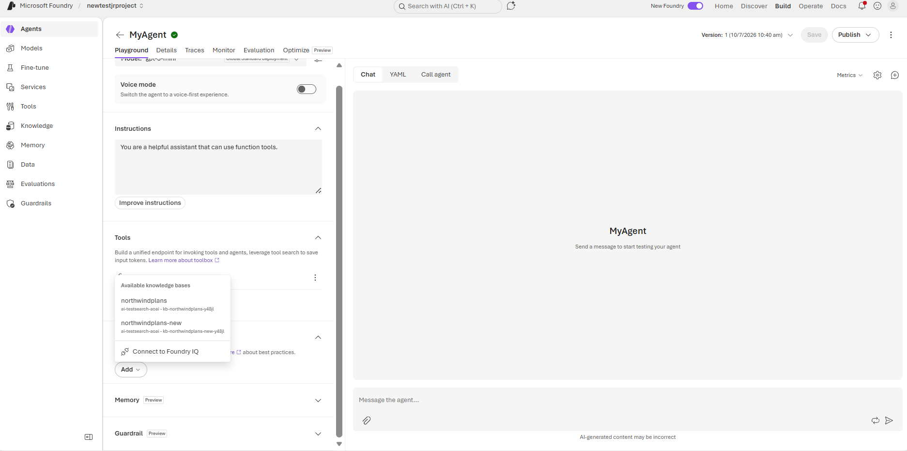
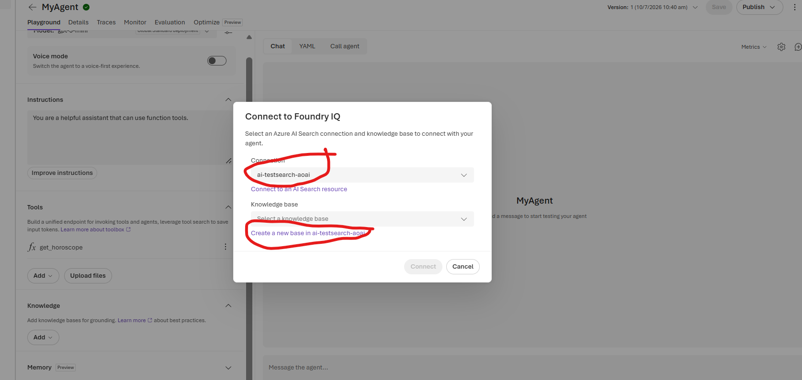
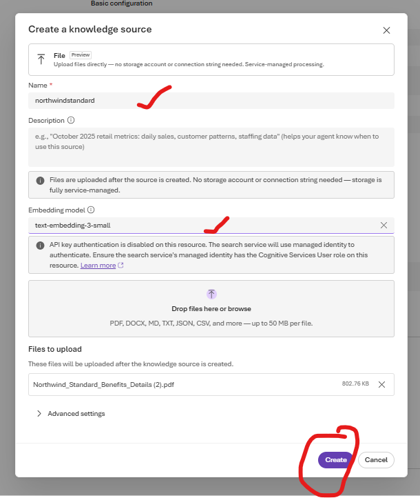

## Create Foundry IQ

### Pre-requisite

1. Microsoft Foundry resource with roles assigned
2. AI search resource with all the roles assigned
3. Agent created in Foundry
4. Models deployed
   
   a. LLM model (eg. gpt-5.4-mini)
   
   b. embedding model (eg. text-embedding3-small) *(preferred)*
   

### Associate Foundry IQ to the agent

1. Click on the Agent you created.
2. Click on *Knowledge* and click *Add*.

3. Click on *Connect to FoundryIQ*. Add *AI search service* name already created. Click to *Create a new base in the Search Service (AI search service name which was created will be displayed)*

4. This will open a new window *Create Knowledge Source*. You can change the *name* (optional), Select the embedding model *(text-embedding- small)*
   

Please note we will add files one by one.

5. Once the index is created add the next file.

Each of the file will be a knowledge base in the knowledge source.

