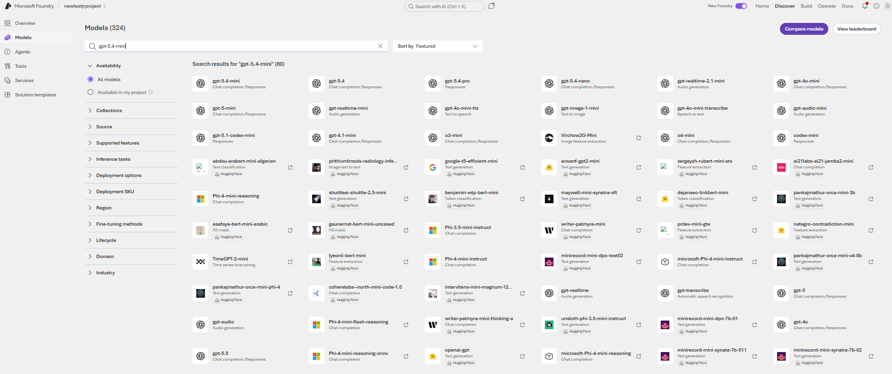
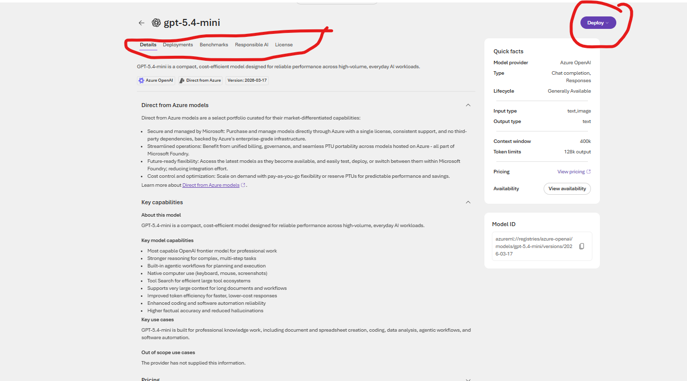
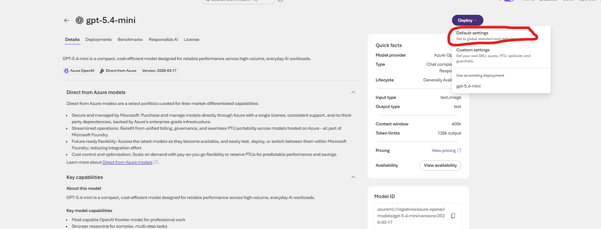
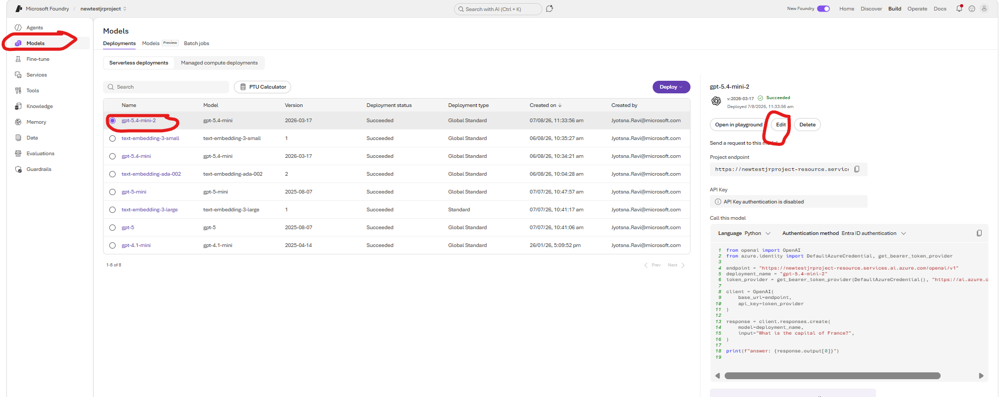

## Model Deployment

# Search Models 

1. You may search for models by name or by using different filters. In this workshop you can search by *gpt-5.4-mini*

2. Select the model. You will be able to see the model details, other deployments if any, Benchmarking (where you can compare with other models as well). Click on *deploy* to initiate deployment.

3. Select *default deployment* and the model will be deployed.

4.  To change the TPMs (Tokens per minute), Check if you are in *Build* tab (top right corner). Else go to "Build* tab and select *Models* in the left pane within your projects. You will see the deployment.

Choose the radio button to select the model, another pane appears in the right-hand side. Click on Edit and make the changes.

5. Repeat the exercise for *text-embedding-3-small* model.

   

